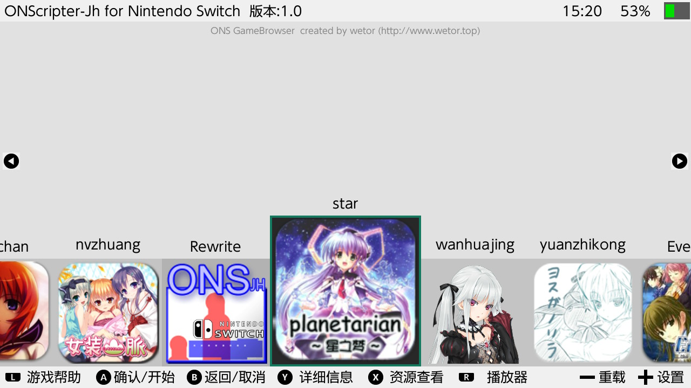
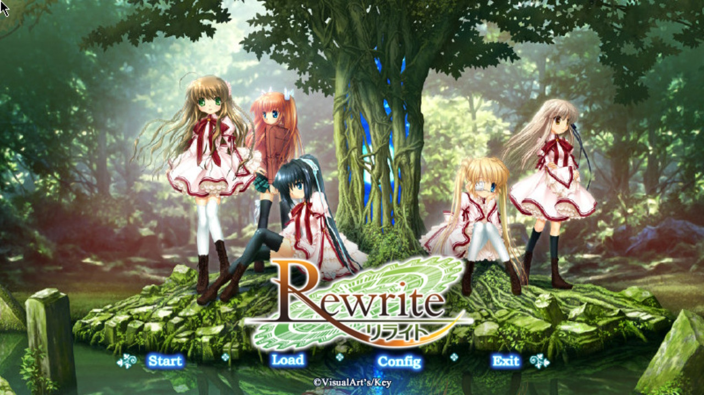

# [2021.7.1 关于12.0无法运行的相关说明](https://github.com/wetor/ONScripter-jh-Switch/issues/5)

# **ONSCripter-jh for Nintendo Switch**
## **简介**
- ONScripter（Open Source Nscripter ）是一个用来解析NScripter脚本的第三方开源Galgame游戏引擎，可以在多种平台和设备上（Windows，Linux，FreeBSD，Android，iOS，Symbian……etc）上运行使用NScripter脚本编译的文字冒险类游戏。
- ONScripter-Jh是jh10001在原有的ONS基础上进行修改，修改目标： 提供比原版ONScripter更好的性能，适当增加一些功能 添加中文支持 尽可能的兼容原版ONS脚本。
- ONScripter-Jh for PSVita是wetor即本人移植的jh版的SDL2分支，用于在PSVita平台运行ONS游戏。
- ONScripter-Jh for Switch是wetor即本人移植的jh版的SDL2分支，用于在Nintendo Switch平台运行ONS游戏。

## 启动器源码
如截图1 2所示  
这个启动器的界面是我从零开始写的，借鉴了很多开源的ns自制程序，当时c++编码能力，代码逻辑比较乱  
https://github.com/wetor/ONS-Switch-GUI  

## **关于Switch版**

  模拟器本体几个月前就完成了...做了个没什么用的浏览器，因为NS已经可以刷安卓了，这种模拟器当然不在话下，所以也没有继续完善的必要了。

  NS比起PSV那孱弱的性能来说真的好太多了，稍微重写了一些地方，ONS就能运行了，也不会出现PSV那种因为IO速度限制导致的卡顿

与其继续研究这个，不如等国外的那个大佬把kirikiroid2移植完再说吧（krkr已经移植到NS了，github仓库名krkrs）。

至于那个ONSBrowser，是用Plutonium自己写的，用了很长时间...纯属娱乐

[**下载地址**](#下载地址)

[**安装说明**](#安装说明)

**ONS for Switch演示视频：https://www.bilibili.com/video/av68622183/**

**ONS for Switch项目：https://github.com/wetor/ONScripter-jh-Switch**


## **截图**







## 下载地址
**请先查看安装说明**

**github下载: https://github.com/wetor/ONScripter-jh-Switch/releases**

或者

**链接: https://pan.baidu.com/s/1lFaTjYLOPluEe8YFBPmW4w 提取码:e8q7**

**微信支付宝扫一扫，你的支持就是我最大的动力。**


## 安装说明
### **安装模拟器**

- 将下载到的压缩包文件解压，得到一个'onsemu'文件夹和一个'ONSBrowser.nsp'文件。
- 将'onsemu'文件夹放到SD卡根目录。
- 安装'ONSBrowser.nsp'，主界面会出现模拟器图标，安装完成。

### **安装游戏**

- 从网上下载ONS游戏包，不区分平台，只要是ONScripter模拟器能运行的游戏资源就可以。
- 检查游戏资源是否完整，简单的辨别方法：一定存在'0.txt'、'00.txt'、'nscript.dat'其中之一，可能存在'\*.nsa'、'\*.sar'文件，大部分存在'icon0.png'。
- 将游戏资源文件夹（不允许存在二级目录）用英文字符重命名，不能用中文字符，放至SD卡的'onsemu'文件夹中，如'SDCard:/onsemu/Rewrite/00.txt'，文件夹名称将作为选择游戏时的重要标志，安装游戏完成。
- 注1：游戏文件夹不能存在中文字符！不能中文！不能中文！否则将无法正常识别。
- 注2：如以上均无误，但是启动游戏后出错，可以使用其他平台的ONS模拟器运行同一资源包实验，如其他平台均无问题，可向我反馈，需提供游戏资源包。

## **使用说明**

- ONSBrowser中对快捷键均有说明，可在选择游戏前按下L键查看帮助。
- 目前Y键的查看详细信息、X键的浏览游戏资源、R键的视频播放器功能均未实现，有生之年在加上，去掉了不好看，按钮就留着了= =。
- 关于游戏名称显示问题，ONSBrowser显示的均是文件夹名称，实际名称由于编码问题无法正常显示。
- 一旦选择游戏并开始，通过游戏内退出功能会导致退出后报错，忽视即可，不影响使用。建议返回主页，直接结束程序即可（就像退出游戏一样）。
- 部分游戏由于脚本问题，按键效果可能不会太符合，但大多数都是没错的。


## **快速启动游戏**
通过主页图标直接运行指定游戏，步骤繁琐，不建议使用

### **使用Nro2Nsp**
- 下载并解压工具，下载地址: https://github.com/Root-MtX/Nro2Nsp/releases
- 在工具的Resources目录下新建一个文件名为`keys.dat`的文本文件，内容粘贴为：(系统相关key，来自网络，经测试可用，也可以用自己提取出来的)，
```html
master_key_00 = c2caaff089b9aed55694876055271c7d
master_key_01 = 54e1b8e999c2fd16cd07b66109acaaa6
master_key_02 = 4f6b10d33072af2f250562bff06b6da3
master_key_03 = 84e04ec20b9373818c540829cf147f3d
master_key_04 = cfa2176790a53ff74974bff2af180921
master_key_05 = c1dbedcebf0dd6956079e506cfa1af6e
master_key_06 = 0aa90e6330cdc12d819b3254d11a4e1e
master_key_07 = 929f86fbfe4ef7732892bf3462511b0e
header_key = aeaab1ca08adf9bef12991f369e3c567d6881e4e4a6a47a51f6e4877062d542d
aes_kek_generation_source = 4d870986c45d20722fba1053da92e8a9
aes_key_generation_source = 89615ee05c31b6805fe58f3da24f7aa8
key_area_key_application_source = 7f59971e629f36a13098066f2144c30d
titlekek_source = 1edc7b3b60e6b4d878b81715985e629b
```
- 上面的信息和图标根据喜好填写即可，`Title Id`注意不要和已安装程序冲突！！
- 有下家齿轮设置，中的`Logo Meun`可以关闭，选中`No Logo`即可，`Save`保存设置。
- 工具主界面选中下面`Retroarch Rom Forwarder`。
- 在`Core Path`中输入'ONScripter.nro'的路径。如按照以上方法安装，则路径为'/onsemu/exefs/ONScripter.nro'。
- 在`Rom Path`中输入游戏资源文件夹路径，如'/onsemu/Rewrite'。
- 点击`Compile`即可在工具目录生成一个nsp，安装即可直接运行指定ONS游戏。
- 注1：如期间移动游戏文件夹，将无法正常启动游戏。
- 注2：如不能正确生成，可去论坛查找解决方法。
### **修改源代码**
修改模拟器源代码，将游戏资源打包进romfs，即可实现独立游戏的打包。
## **相关链接**
原版ONScripter官网：https://onscripter.osdn.jp/onscripter.html

ONScripter-Jh项目：https://bitbucket.org/jh10001/onscripter-jh

ONS for PSVita：http://www.wetor.top/onscripter-psvita.html

ONS for PSVita项目：https://github.com/wetor/ONScripter-jh-PSVita

**ONS for Switch演示视频：https://www.bilibili.com/video/av68622183/**

**ONS for Switch项目：https://github.com/wetor/ONScripter-jh-Switch**

**ONS for Switch发布页：http://www.wetor.top/onscripter-ns.html**

